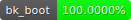

# banjo (99.6748%)


- 
-   
-   
- 
- 
- 
- 
- 
- 
- 
- 
- 
- 
- 
- 
- 

## Remaining Functions
These all are the remaining NTSC-USA V1.0 function left to be matched.
Be sure to check scratch "family" for any progress that may not be reflected here

| File               | Function        | Scratch Link                             | %      | Notes |
| ------------------ | --------------- | ---------------------------------------- | ------ | ----- |
| core2/code_12F30.c | func_80299EC0   | [Ar62G](https://decomp.me/scratch/Ar62G) | 77.65% |
| core2/code_B9770.c | func_80340BE4   | [FXyYS](https://decomp.me/scratch/FXyYS) | 65.91% | spline function 
| core2/code_B9770.c | func_803411B0   | [rHkDu](https://decomp.me/scratch/rHkDu) | 87.70% | spline function

## Building

Grab tools

```sh
git submodule update --init --recursive
```

Drop in `US v1.0` as `baserom.us.v10.z64` (sha1sum: `1fe1632098865f639e22c11b9a81ee8f29c75d7a`)

To extract and build everything

```sh
make
```

where the following are supported values of `<module_id>`
- `core1`
- `core2`
- `MM`
- `TTC`
- `CC`
- `BGS`
- `FP`
- `lair`
- `GV`
- `CCW`
- `RBB`
- `MMM`
- `SM`
- `fight`
- `cutscenes`

### Prerequisites

Ubuntu 18.04 or higher.

```sh
sudo apt-get update && sudo apt-get install -y $(cat packages.txt)

curl --proto '=https' --tlsv1.2 -sSf https://sh.rustup.rs | sh

python3 -m pip install -r requirements.txt
```

### Other versions

Drop in `us.v11`, `jp`, or `pal` as `baserom.<version>.z64` e.g. `baserom.us.v11.z64`

```sh
make VERSION=us.v11
```
